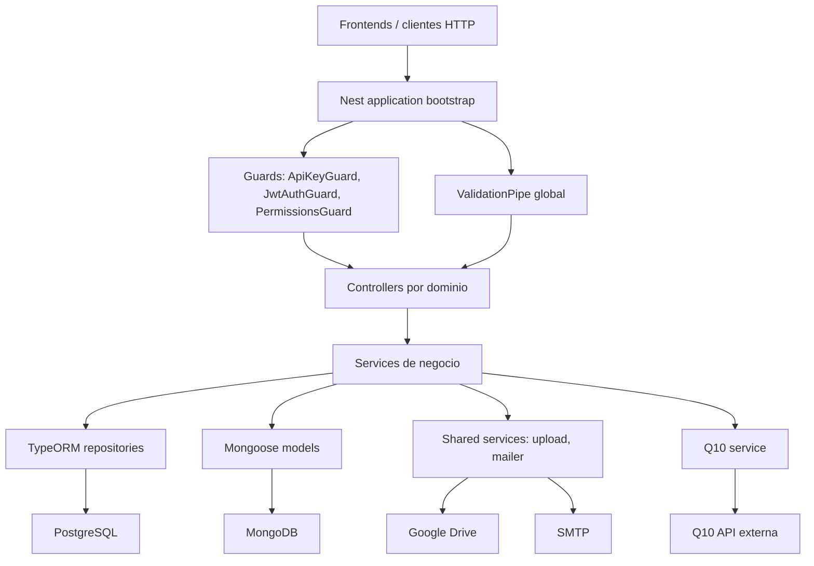

# Contenedores y Capas

## Bootstrap

`src/main.ts` crea la aplicacion, habilita CORS para dominios conocidos, aplica `ValidationPipe` global y configura Helmet. La app escucha en `PORT` o `3000`.

## Modulo raiz

`src/app.module.ts` configura:

- `ConfigModule.forRoot` global.
- `JwtModule` y `PassportModule`.
- `TypeOrmModule.forRootAsync` para PostgreSQL.
- `MongooseModule.forRootAsync` para MongoDB.
- Modulos funcionales bajo `src/modules`.
- Integraciones `Q10Module`, `UploadModule` y `MailerModule`.

## Convenciones de modulo

Cada feature debe mantener:

- Controller para rutas HTTP.
- Service para logica de negocio.
- DTOs para request payloads.
- Entity TypeORM o Schema Mongoose segun persistencia.
- Tests unitarios en `*.spec.ts`.

## Backlog OpenAPI

Para generar contratos verificables:

1. Instalar `@nestjs/swagger` y `swagger-ui-express`.
2. Configurar `SwaggerModule` en `main.ts`.
3. Agregar `@ApiTags` por controller.
4. Agregar `@ApiOperation`, `@ApiResponse`, `@ApiBearerAuth` y `@ApiHeader({ name: 'x-api-key' })`.
5. Decorar DTOs con `@ApiProperty`.
6. Publicar una ruta interna, por ejemplo `/api/docs`, protegida segun ambiente.
