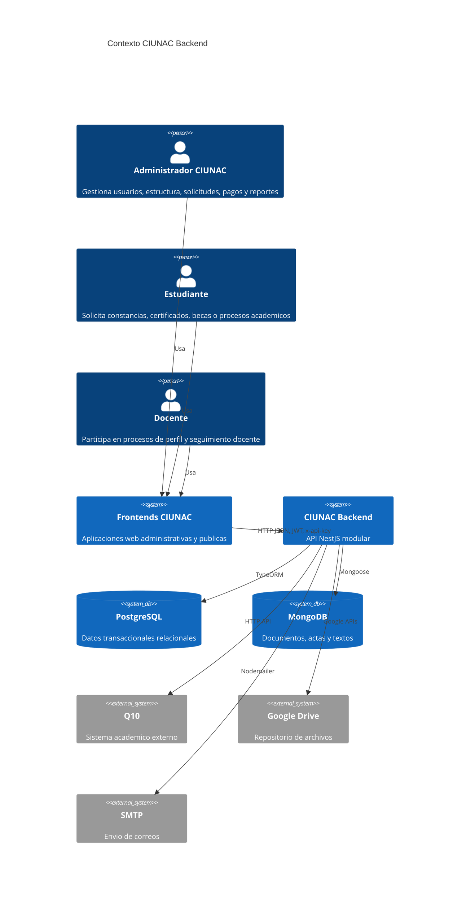

# Contexto del Sistema

Este diagrama muestra CIUNAC Backend como sistema central y sus dependencias principales.

## Sistemas externos

| Sistema | Uso actual |
| --- | --- |
| Frontends CIUNAC | Consumen endpoints con `Authorization` y/o `x-api-key`. |
| PostgreSQL | Entidades principales: usuarios, estudiantes, docentes, estructura, calificaciones, solicitudes, pagos y seguimiento docente. |
| MongoDB | Schemas de textos, certificados, constancias, actas y solicitudes de beca. |
| Q10 | Creacion de estudiantes y gestion de horarios/cursos. |
| Google Drive | Carga y movimiento de archivos para DNI, becas, vouchers, CVs y constancias. |
| SMTP | Correos por canales de alumnos, certificados y recauda. |
