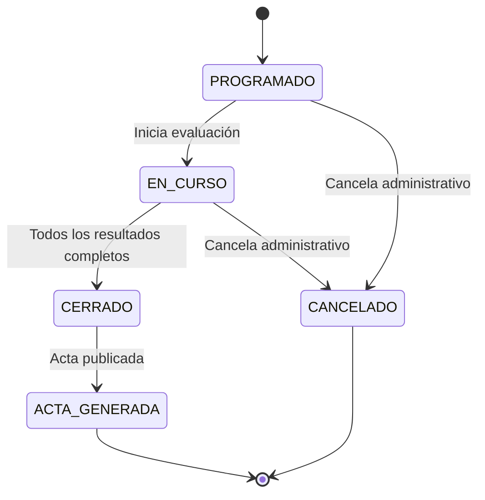
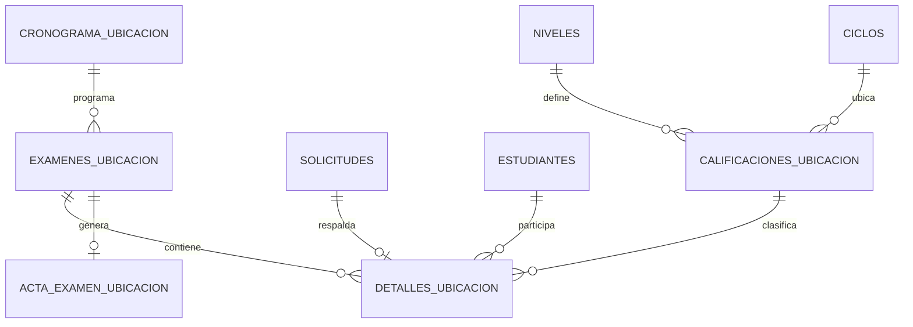
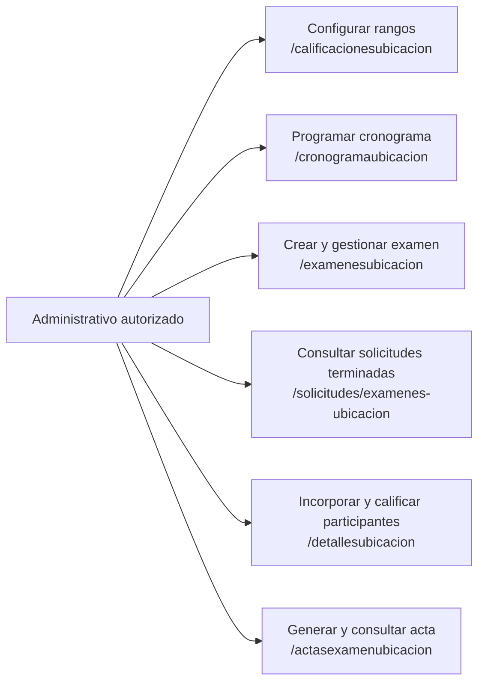
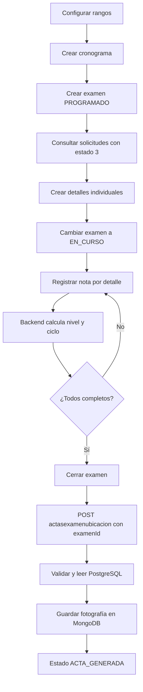
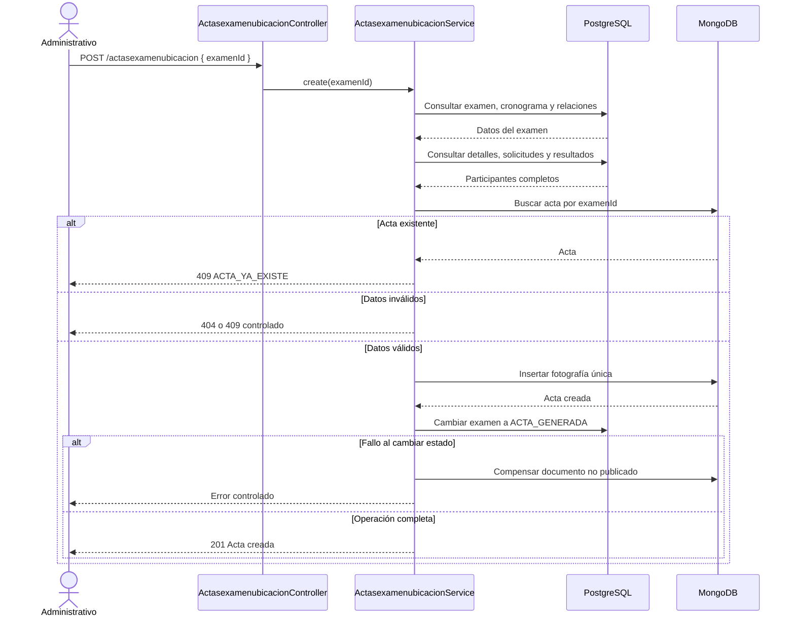

# Spec SDD: Exámenes de ubicación

## Estado

**Especificado, pendiente de implementación.**

El punto 8 se detalla en [Implementación SDD: Actas de examen de ubicación](implementacion-actas-examen-ubicacion.md).

Este documento distingue el comportamiento actual (`AS-IS`) del comportamiento requerido (`TO-BE`). La implementación debe conservar las rutas HTTP existentes; no se autorizan endpoints adicionales para este dominio.

## Objetivo funcional

Gestionar el ciclo completo de un examen de ubicación, desde la configuración de rangos y el cronograma hasta el registro de participantes, cálculo del resultado, cierre y generación de un acta histórica en MongoDB.

El acta debe generarse enviando únicamente `examenId`. El backend es responsable de obtener, validar y consolidar desde PostgreSQL todos los datos del examen y la trazabilidad de cada participante.

## Alcance

Incluye:

- Configuración de rangos de nota para determinar nivel y ciclo.
- Programación de cronogramas y creación de exámenes.
- Selección individual de solicitudes elegibles.
- Registro de notas y cálculo del resultado de ubicación.
- Cierre del examen.
- Generación y consulta de un acta única e inmutable.

No incluye generación de PDF, firma digital, notificaciones, nuevas rutas HTTP ni corrección de actas ya publicadas.

## Actores

- **Administrativo autorizado:** configura, programa, registra participantes y notas, cierra el examen y genera el acta.
- **Estudiante evaluado:** participa mediante una solicitud de examen de ubicación validada.
- **Frontend administrativo:** consume las rutas existentes.
- **PostgreSQL:** fuente transaccional de examen, participantes, solicitudes y catálogos.
- **MongoDB:** almacena la fotografía histórica del acta.

## Historias de usuario

| ID | Historia | Ruta principal |
| --- | --- | --- |
| HU-EXU-001 | [Configurar rangos de ubicación](historias-usuario/examen-ubicacion/hu-exu-001-configurar-rangos.md) | `/calificacionesubicacion` |
| HU-EXU-002 | [Programar cronograma](historias-usuario/examen-ubicacion/hu-exu-002-programar-cronograma.md) | `/cronogramaubicacion` |
| HU-EXU-003 | [Crear examen](historias-usuario/examen-ubicacion/hu-exu-003-crear-examen.md) | `/examenesubicacion` |
| HU-EXU-004 | [Incorporar participantes](historias-usuario/examen-ubicacion/hu-exu-004-incorporar-participantes.md) | `/solicitudes/examenes-ubicacion`, `/detallesubicacion` |
| HU-EXU-005 | [Registrar notas y calcular ubicación](historias-usuario/examen-ubicacion/hu-exu-005-registrar-resultados.md) | `/detallesubicacion/:id` |
| HU-EXU-006 | [Cerrar examen](historias-usuario/examen-ubicacion/hu-exu-006-cerrar-examen.md) | `/examenesubicacion/:id` |
| HU-EXU-007 | [Generar acta](historias-usuario/examen-ubicacion/hu-exu-007-generar-acta.md) | `/actasexamenubicacion` |
| HU-EXU-008 | [Consultar actas y resultados](historias-usuario/examen-ubicacion/hu-exu-008-consultar-actas.md) | `/actasexamenubicacion`, `/actasexamenubicacion/:id` |

## Estado actual (AS-IS)

No existe prefijo global de rutas. Los cinco controladores aplican `ApiKeyGuard` y exponen:

| Módulo | Rutas actuales |
| --- | --- |
| Cronograma | `POST /cronogramaubicacion`, `GET /cronogramaubicacion`, `GET /cronogramaubicacion/:id`, `PATCH /cronogramaubicacion/:id`, `DELETE /cronogramaubicacion/:id` |
| Exámenes | `POST /examenesubicacion`, `GET /examenesubicacion`, `GET /examenesubicacion/:id`, `PATCH /examenesubicacion/:id`, `DELETE /examenesubicacion/:id` |
| Rangos | `POST /calificacionesubicacion`, `GET /calificacionesubicacion`, `GET /calificacionesubicacion/:id`, `PATCH /calificacionesubicacion/:id`, `DELETE /calificacionesubicacion/:id` |
| Detalles | `POST /detallesubicacion`, `GET /detallesubicacion`, `GET /detallesubicacion/examen/:id`, `GET /detallesubicacion/estudiante/documento/:documentNumber`, `GET /detallesubicacion/:id`, `PATCH /detallesubicacion/:id`, `DELETE /detallesubicacion/:id` |
| Actas | `POST /actasexamenubicacion`, `GET /actasexamenubicacion`, `GET /actasexamenubicacion/:id`, `PATCH /actasexamenubicacion/:id`, `DELETE /actasexamenubicacion/:id` |
| Solicitudes de apoyo | `GET /solicitudes/examenes-ubicacion?estado=3` |

Brechas actuales:

- El examen no referencia un cronograma.
- El cliente envía al detalle el resultado ya calculado.
- El acta acepta una estructura completa proporcionada por el cliente.
- El schema del acta no conserva `examenId`, `solicitudId` ni `numeroVoucher`.
- No existe unicidad por examen ni validación integral antes de guardar el acta.
- Las actas pueden modificarse o eliminarse mediante rutas CRUD.
- Los tests del módulo comprueban principalmente que providers y controllers se construyan.

## Comportamiento objetivo (TO-BE)

Se mantienen todas las rutas. Los cambios se realizan sobre sus contratos y reglas:

- `POST /examenesubicacion` incorpora `cronogramaId` obligatorio.
- `POST /detallesubicacion` continúa incorporando un participante por solicitud.
- `PATCH /detallesubicacion/:id` recibe la nota y `terminado`; el backend calcula la calificación, nivel y ciclo.
- `PATCH /examenesubicacion/:id` realiza las transiciones del ciclo del examen.
- `POST /actasexamenubicacion` recibe únicamente `{ "examenId": number }`.
- `PATCH` y `DELETE` de actas permanecen visibles durante la transición, se marcan como deprecados y rechazan cambios sobre actas publicadas con `409 ACTA_INMUTABLE`.

## Requisitos funcionales

| ID | Requisito |
| --- | --- |
| RF-EXU-001 | Permitir configurar rangos de ubicación por idioma, nivel y ciclo mediante las rutas actuales de `calificacionesubicacion`. |
| RF-EXU-002 | Validar que los rangos configurados cubran la escala 0–100 sin solapamientos; cada nota debe corresponder a un único resultado. |
| RF-EXU-003 | Crear un cronograma con módulo, fecha e indicador `activo`, sin exigir que dicho indicador sea `true`. |
| RF-EXU-004 | Crear cada examen asociado obligatoriamente a un cronograma existente, docente, aula, idioma y estado `PROGRAMADO`. |
| RF-EXU-005 | Mostrar solicitudes de tipo examen de ubicación con pago verificado y flujo terminado (`estado=3`) usando la ruta existente de solicitudes. |
| RF-EXU-006 | Incorporar individualmente participantes cuya solicitud tenga idioma compatible, voucher y no esté asignada a otro examen activo. |
| RF-EXU-007 | Registrar la nota por detalle y calcular en backend `calificacionId`, `nivelId` y ciclo según los rangos configurados. |
| RF-EXU-008 | Cerrar el examen únicamente cuando todos sus participantes activos tengan nota, resultado, solicitud, voucher y `terminado=true`. |
| RF-EXU-009 | Generar el acta recibiendo solo `examenId` y consolidando los datos desde PostgreSQL. |
| RF-EXU-010 | Garantizar una única acta por `examenId`; un segundo intento responde `409 Conflict` y referencia el acta existente. |
| RF-EXU-011 | Mantener el acta publicada inmutable, sin edición, borrado ni nuevas versiones. |
| RF-EXU-012 | Permitir listar actas y consultar una por su identificador MongoDB mediante las rutas existentes. |

## Requisitos no funcionales

| ID | Requisito |
| --- | --- |
| RNF-EXU-001 | Validar todos los payloads con DTOs, `class-validator` y el `ValidationPipe` global. |
| RNF-EXU-002 | Mantener `ApiKeyGuard`; las operaciones administrativas objetivo también deben identificar al usuario mediante JWT y permiso `gestionar_examen_ubicacion`. |
| RNF-EXU-003 | No registrar vouchers, documentos completos ni secretos en logs de error. |
| RNF-EXU-004 | Crear un índice único MongoDB para `examenId` y controlar también la colisión de concurrencia. |
| RNF-EXU-005 | Evitar persistencias parciales: todas las validaciones deben completarse antes de crear el documento MongoDB. |
| RNF-EXU-006 | Si el documento se inserta pero falla el cambio de estado PostgreSQL, eliminar el documento aún no publicado como compensación y registrar el fallo. |
| RNF-EXU-007 | Conservar tipos de retorno explícitos, excepciones HTTP de NestJS y pruebas unitarias de reglas de negocio. |

## Ciclo de estados

La fuente de verdad es la tabla PostgreSQL `estados`. El backend debe buscar el registro por `nombre` y `referencia = EXAMEN_UBICACION`, obtener su `id` numérico y persistirlo en `examenes_ubicacion.estado_id`; no se usan números mágicos.



No se permiten transiciones desde `ACTA_GENERADA` ni generación de actas desde un estado distinto de `CERRADO`.

## Reglas de negocio

1. Una solicitud elegible tiene `tipoSolicitudId=7`, `estadoId=3` (`TERMINADO`), `numeroVoucher` no vacío, idioma igual al examen y no está asociada a otro detalle activo. `estadoId=4` (`PAGADO`) es intermedio y no habilita la generación del acta.
2. El cronograma debe existir, pero puede estar activo o inactivo. `Examenesubicacion.fecha` debe coincidir con el mismo día calendario de `Cronogramaubicacion.fecha`; se conserva la fecha del examen por compatibilidad.
3. Debe existir al menos un participante activo para cerrar y generar el acta.
4. La nota se encuentra entre 0 y 100 y debe coincidir exactamente con un rango configurado.
5. El cliente no decide `nivelId`, ciclo ni `calificacionId` durante el registro de resultados.
6. Los participantes se incorporan uno por uno mediante `POST /detallesubicacion`; no se define una ruta masiva.
7. El acta representa una fotografía: cambios posteriores en PostgreSQL no alteran el documento ya publicado.
8. La inmutabilidad comienza cuando MongoDB guarda el documento y PostgreSQL confirma `ACTA_GENERADA`.

## Casos de uso

| ID | Actor | Precondición | Flujo principal | Resultado |
| --- | --- | --- | --- | --- |
| CU-EXU-001 | Administrativo | Idioma, nivel y ciclo existentes | Usa CRUD de rangos y define límites 0–100 | Rangos válidos disponibles |
| CU-EXU-002 | Administrativo | Módulo existente | Crea cronograma con fecha e indicador de vigencia | Cronograma programado |
| CU-EXU-003 | Administrativo | Cronograma existente | Crea examen con cronograma, docente, aula e idioma | Examen `PROGRAMADO` |
| CU-EXU-004 | Administrativo | Solicitud tipo 7 terminada | Consulta `estado=3` y crea un detalle | Participante incorporado |
| CU-EXU-005 | Administrativo | Examen `EN_CURSO` | Actualiza nota y terminación del detalle | Nivel y ciclo calculados |
| CU-EXU-006 | Administrativo | Todos los detalles completos | Actualiza estado del examen | Examen `CERRADO` |
| CU-EXU-007 | Administrativo | Examen `CERRADO` sin acta | Envía `{ examenId }` a la ruta actual | Acta MongoDB y estado `ACTA_GENERADA` |
| CU-EXU-008 | Administrativo | Acta existente | Lista o consulta por `_id` | Fotografía histórica recuperada |

### Alternativas y errores comunes

| Condición | Resultado esperado |
| --- | --- |
| Payload inválido o nota fuera de 0–100 | `400 Bad Request` |
| API key o JWT ausente/inválido | `401 Unauthorized` |
| Usuario sin permiso administrativo | `403 Forbidden` |
| Cronograma, examen, detalle, solicitud o acta inexistente | `404 Not Found` |
| Solicitud no elegible, participante incompleto o transición inválida | `409 Conflict` |
| Acta ya existente | `409 Conflict` con código `ACTA_YA_EXISTE` y referencia al acta |
| Intento de modificar o borrar un acta publicada | `409 Conflict` con código `ACTA_INMUTABLE` |
| Fallo PostgreSQL o MongoDB | Error controlado; no se publica un acta parcial |

## Contratos API

### Rutas sin cambio de URI

| Método | Endpoint | Uso objetivo |
| --- | --- | --- |
| `POST/GET` | `/calificacionesubicacion` | Crear y listar rangos |
| `GET/PATCH/DELETE` | `/calificacionesubicacion/:id` | Consultar y mantener un rango |
| `POST/GET` | `/cronogramaubicacion` | Crear y listar cronogramas |
| `GET/PATCH/DELETE` | `/cronogramaubicacion/:id` | Consultar y mantener un cronograma |
| `POST/GET` | `/examenesubicacion` | Crear y listar exámenes |
| `GET/PATCH/DELETE` | `/examenesubicacion/:id` | Consultar, actualizar estado o eliminar según reglas |
| `GET` | `/solicitudes/examenes-ubicacion?estado=3` | Obtener solicitudes candidatas terminadas |
| `POST/GET` | `/detallesubicacion` | Incorporar y listar participantes |
| `GET` | `/detallesubicacion/examen/:id` | Consultar participantes de un examen |
| `GET` | `/detallesubicacion/estudiante/documento/:documentNumber` | Consultar historial del estudiante |
| `GET/PATCH/DELETE` | `/detallesubicacion/:id` | Consultar, registrar resultado o desactivar detalle |
| `POST/GET` | `/actasexamenubicacion` | Generar y listar actas |
| `GET` | `/actasexamenubicacion/:id` | Consultar acta por `_id` |
| `PATCH/DELETE` | `/actasexamenubicacion/:id` | Rutas legadas deprecadas; rechazan actas publicadas |

### Generar acta

```http
POST /actasexamenubicacion
x-api-key: <API_KEY>
Authorization: Bearer <JWT>
Content-Type: application/json
```

```json
{
  "examenId": 123
}
```

Respuesta `201 Created` resumida:

```json
{
  "_id": "mongo-id",
  "examenId": 123,
  "codigo": "EU-2026-001",
  "fecha": "2026-07-06T00:00:00.000Z",
  "idioma": { "id": 1, "nombre": "Inglés" },
  "aula": { "id": 4, "nombre": "A-201", "tipo": "FISICA", "ubicacion": "Pabellón A" },
  "docente": { "id": "uuid", "nombres": "Ana", "apellidos": "Pérez" },
  "participantes": [
    {
      "detalleId": 77,
      "solicitudId": 9001,
      "numeroVoucher": "V-2026-100",
      "estudiante": {
        "id": "uuid",
        "tipoDocumento": "DNI",
        "numeroDocumento": "12345678",
        "nombres": "Luis",
        "apellidos": "Quispe"
      },
      "nota": 84,
      "nivel": { "id": 3, "nombre": "Intermedio" },
      "ciclo": { "id": 8, "nombre": "Intermedio 2", "codigo": "I2" },
      "terminado": true
    }
  ],
  "creado_en": "2026-07-06T15:00:00.000Z"
}
```

El DTO público de creación contiene solamente `examenId`. Las estructuras descriptivas son generadas internamente y no se aceptan desde el cliente.

## Modelo de datos objetivo

### PostgreSQL

- `Cronogramaubicacion`: módulo, fecha y vigencia.
- `Examenesubicacion`: agrega `cronogramaId`; conserva código, fecha, estado, idioma, docente y aula.
- `Detallesubicacion`: enlaza solicitud, estudiante, examen, nota y resultado calculado.
- `Calificacionesubicacion`: enlaza idioma, nivel, ciclo y rango de nota.
- `Solicitud`: aporta `id`, tipo, estado, idioma y `numeroVoucher`.

### MongoDB: `actas_examen_ubicacion`

- `examenId`: número obligatorio con índice único.
- Datos descriptivos del examen, cronograma, docente, aula e idioma.
- Participantes embebidos con `detalleId`, `solicitudId`, `numeroVoucher`, estudiante, nota, nivel, ciclo y `terminado`.
- Identidad del usuario generador obtenida del JWT de la operación.
- `creado_en`; `modificado_en` no representa edición funcional porque el acta es inmutable.



## Diagramas de flujo

### Casos de uso y rutas



### Flujo completo



### Secuencia de generación



## Pruebas y aceptación

| Nivel | Escenarios mínimos |
| --- | --- |
| Unit DTO | `examenId` válido, ausente, texto no convertible y campos adicionales rechazados |
| Unit rangos | Nota con una coincidencia, sin coincidencia y rangos solapados |
| Unit detalles | Solicitud elegible, voucher faltante, idioma distinto y participante duplicado |
| Unit acta | Éxito, examen inexistente, estado inválido, sin participantes, participante incompleto y acta duplicada |
| Unit compensación | Fallo MongoDB, fallo de cambio de estado y fallo de compensación registrado |
| Controller | Delegación, `201`, `400`, `404`, `409` y rutas legadas inmutables |
| E2E | API key/JWT/permisos, flujo examen cerrado → acta, segundo intento y consulta por `_id` |

## Matriz de trazabilidad

| Historia | Requisitos | Caso de uso | Rutas | Datos | Pruebas |
| --- | --- | --- | --- | --- | --- |
| HU-EXU-001 | RF-EXU-001, RF-EXU-002 | CU-EXU-001 | `/calificacionesubicacion` | `Calificacionesubicacion` | Rangos y límites |
| HU-EXU-002 | RF-EXU-003 | CU-EXU-002 | `/cronogramaubicacion` | `Cronogramaubicacion` | Fecha, módulo, vigencia |
| HU-EXU-003 | RF-EXU-004 | CU-EXU-003 | `/examenesubicacion` | `Examenesubicacion` | Cronograma y estado |
| HU-EXU-004 | RF-EXU-005, RF-EXU-006 | CU-EXU-004 | `/solicitudes/examenes-ubicacion`, `/detallesubicacion` | `Solicitud`, `Detallesubicacion` | Elegibilidad y duplicidad |
| HU-EXU-005 | RF-EXU-002, RF-EXU-007 | CU-EXU-005 | `/detallesubicacion/:id` | Detalle y rango | Cálculo de resultado |
| HU-EXU-006 | RF-EXU-008 | CU-EXU-006 | `/examenesubicacion/:id` | Examen y detalles | Reglas de cierre |
| HU-EXU-007 | RF-EXU-009, RF-EXU-010, RF-EXU-011 | CU-EXU-007 | `/actasexamenubicacion` | PostgreSQL + MongoDB | Consolidación e inmutabilidad |
| HU-EXU-008 | RF-EXU-012 | CU-EXU-008 | `/actasexamenubicacion`, `/actasexamenubicacion/:id` | `ActaExamenUbicacion` | Lista, detalle y 404 |

## Trazabilidad técnica

| Elemento | Referencia |
| --- | --- |
| Controllers | `src/modules/examen_ubicacion/*/*.controller.ts` |
| Services | `src/modules/examen_ubicacion/*/*.service.ts` |
| DTOs | `src/modules/examen_ubicacion/*/dto/*.dto.ts` |
| Entidades | `src/modules/examen_ubicacion/*/entities/*.entity.ts` |
| Schema | `src/modules/examen_ubicacion/actasexamenubicacion/schemas/actasexamenubicacion.schema.ts` |
| Solicitudes | `src/modules/administrativas/solicitudes` |

## Migración y compatibilidad

1. Mantener las URI actuales y actualizar primero documentación, DTOs y OpenAPI.
2. Añadir `cronogramaId` mediante migración TypeORM; `synchronize` permanece desactivado.
3. Añadir `examenId` e índice único al schema MongoDB antes de habilitar generación consolidada.
4. Cambiar el consumidor de `POST /actasexamenubicacion` para enviar solamente `examenId`.
5. Marcar `PATCH` y `DELETE` de actas como deprecados; las actas publicadas responden `409 ACTA_INMUTABLE`.
6. No alterar documentos históricos sin un procedimiento de migración explícito.
