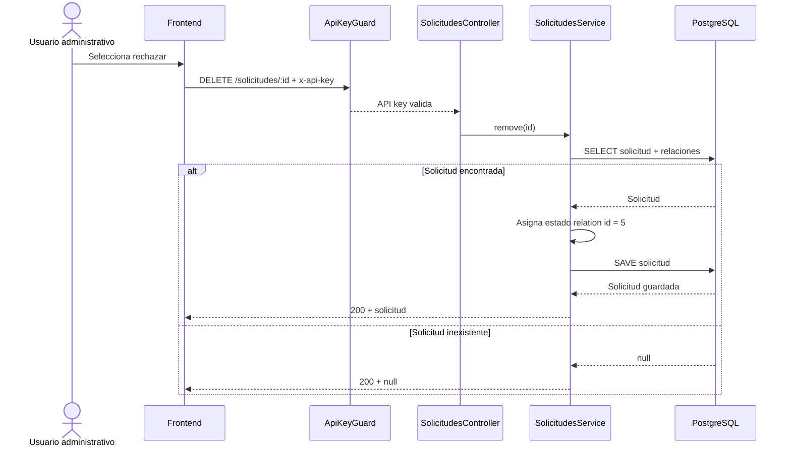
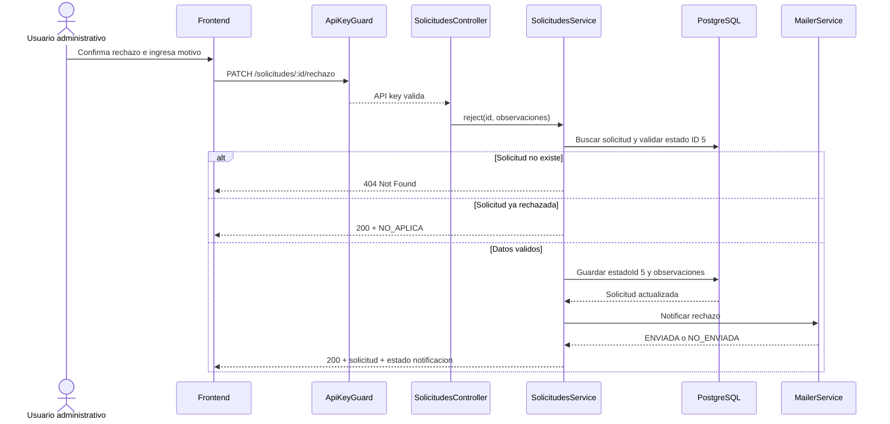

# Spec: Rechazo de Solicitud

## Objetivo

Documentar el rechazo dedicado de solicitudes y la migracion desde el endpoint legado que mezclaba rechazo con eliminacion.

## Estado funcional implementado

El flujo nuevo usa `PATCH /solicitudes/:id/rechazo`, guarda `observaciones`, cambia explicitamente `estadoId` a `5` y envia el correo desde el backend. El endpoint `DELETE /solicitudes/:id` se conserva temporalmente como flujo legado deprecado.

El ID rechazado esta centralizado como `SolicitudEstadoId.RECHAZADO = 5` y se valida contra la tabla `estados` con referencia `SOLICITUD` antes de actualizar.

## Endpoint legado

El backend historicamente interpreta `DELETE /solicitudes/:id` como rechazo logico. No elimina el registro de PostgreSQL: busca la solicitud, asigna la relacion `estado` con ID `5` y guarda la entidad. Este endpoint no recibe observaciones ni envia correo y debe dejar de consumirse desde frontend.

### Request legado

```http
DELETE /solicitudes/{id}
x-api-key: <API_KEY>
```

No recibe body, motivo, usuario responsable ni tipo de rechazo.

### Response actual

- Si existe: responde `200 OK` con la entidad `Solicitud` guardada.
- Si no existe: responde `200 OK` con `null`.
- Si falla la base: NestJS devuelve un error no normalizado segun la excepcion de TypeORM.

### Trazabilidad

| Paso | Implementacion |
| --- | --- |
| Seguridad | `ApiKeyGuard` a nivel de `SolicitudesController` |
| Ruta | `SolicitudesController.remove(id)` |
| Servicio | `SolicitudesService.remove(id)` |
| Consulta | `findOne(id)` con estudiante, tipo, idioma, nivel y estado |
| Cambio | `item.estado = { id: 5 }` |
| Persistencia | `solicitudRepository.save(item)` |
| Tabla | `solicitudes`, columna FK `estado_id` |

## Flujo legado



## Endpoints relacionados

| Metodo | Endpoint | Uso en el proceso |
| --- | --- | --- |
| `GET` | `/solicitudes/:id` | Obtiene la solicitud antes o despues del rechazo. |
| `PATCH` | `/solicitudes/:id` | Puede modificar `estadoId` y `observaciones` porque usa `UpdateSolicitudDto`; no aplica reglas de transicion. |
| `PATCH` | `/solicitudes/:id/rechazo` | Rechaza, guarda observaciones y envia la notificacion desde backend. |
| `DELETE` | `/solicitudes/:id` | Rechazo logico actual mediante estado ID `5`. |
| `GET` | `/solicitudes/certificados?estado=5` | Lista certificados rechazados si el estado `5` corresponde realmente a rechazo. |
| `GET` | `/solicitudes/constancias?estado=5` | Lista constancias rechazadas. |
| `GET` | `/solicitudes/examenes-ubicacion?estado=5` | Lista examenes de ubicacion rechazados. |
| `GET` | `/solicitudes/documento/:numeroDocumento` | Permite al frontend consultar solicitudes del estudiante y su estado. |
| `POST` | `/mailer` | Endpoint generico; el frontend no debe usarlo para completar el rechazo. |

## Limitaciones del endpoint legado

- No se guarda motivo de rechazo automaticamente.
- No se valida que `observaciones` tenga contenido.
- No se registra quien rechazo la solicitud.
- No se registra fecha especifica de rechazo, solo puede cambiar `modificado_en`.
- No se valida que la solicitud pueda pasar desde su estado actual a rechazado.
- No se envia correo automaticamente.
- No se actualizan o eliminan documentos MongoDB de certificados o constancias.
- No existe transaccion que agrupe estado, auditoria y efectos secundarios.
- No se exige JWT ni permiso administrativo; basta una API key valida.

## Interaccion con pagos

`PagosBancoService` cambia solicitudes de estado `1` a `4` si monto y fecha coinciden, o a `2` si no coinciden. Para solicitudes con estado `2`, `3`, `4` o `5`, el pago puede marcarse como verificado sin volver a validar monto y fecha.

Por tanto, una solicitud rechazada con estado `5` puede hacer que un pago pendiente pase a `verificado = true` durante una carga o reverificacion. Esta regla debe confirmarse con negocio porque "pago verificado" y "solicitud rechazada" son conceptos distintos.

## Problemas corregidos por el nuevo endpoint

1. `DELETE` comunica eliminacion, pero ejecuta una transicion de estado.
2. El estado rechazado depende del numero magico `5`.
3. El service asigna `estado`, pero no actualiza explicitamente `estadoId`; la respuesta puede conservar valores inconsistentes en memoria.
4. Una solicitud inexistente devuelve `200 null` en vez de `404`.
5. `PATCH /solicitudes/:id` permite cambiar libremente cualquier campo de creacion, incluido `estadoId`, sin reglas de negocio.
6. El rechazo no exige motivo aunque la entidad ya contiene `observaciones`.
7. No existian pruebas utiles de controller/service para esta transicion.

Se conserva como riesgo aceptado que la accion utiliza solo API key y no registra el usuario que realiza el rechazo.

## Flujo implementado

### Nuevo contrato

```http
PATCH /solicitudes/{id}/rechazo
x-api-key: <API_KEY>
Content-Type: application/json

{
  "observaciones": "El voucher no corresponde al monto declarado"
}
```

### Response propuesta

```json
{
  "solicitud": {
    "id": 123,
    "estadoId": 5,
    "observaciones": "El voucher no corresponde al monto declarado",
    "modificadoEn": "2026-06-22T15:00:00.000Z"
  },
  "notificacion": {
    "estado": "ENVIADA"
  }
}
```

`notificacion.estado` puede ser `ENVIADA`, `NO_ENVIADA` o `NO_APLICA`. Los motivos estables son `ESTUDIANTE_SIN_EMAIL`, `ERROR_ENVIO` y `YA_RECHAZADA`. Un fallo de correo no revierte el rechazo confirmado.

### Proceso



## Responsabilidad del frontend

- Mostrar accion `Rechazar` solo a usuarios autorizados.
- Solicitar confirmacion y motivo obligatorio.
- No decidir el ID del estado; solo enviar la intencion de rechazo.
- Deshabilitar el boton mientras se procesa la peticion.
- Mostrar errores `400`, `401`, `404` y `500` con mensajes adecuados.
- Refrescar detalle y listas despues de una respuesta exitosa.
- Mostrar el motivo de rechazo en la consulta del estudiante cuando el negocio lo permita.

## Responsabilidad del backend

- Ser la fuente de verdad de transiciones de estado.
- Resolver el estado rechazado mediante `SolicitudEstadoId.RECHAZADO` y validar su referencia en la tabla `estados`.
- Validar observaciones y permitir el rechazo desde cualquier estado distinto de `5`.
- Persistir explicitamente `estadoId`, relacion `estado`, `observaciones` y `modificadoEn`.
- Aplicar `ApiKeyGuard` segun el contrato acordado.
- Notificar o registrar una notificacion pendiente.
- Responder codigos HTTP consistentes.

## Criterios de aceptacion

- Dada una solicitud existente, cuando el cliente envia observaciones validas, entonces queda rechazada y conserva las observaciones.
- Dada una solicitud inexistente, cuando se intenta rechazar, entonces responde `404`.
- Dada una solicitud en cualquier estado distinto de `5`, cuando se rechaza, entonces cambia a estado `5`.
- Dada una solicitud ya rechazada, cuando se repite la peticion, entonces responde `NO_APLICA`, conserva las observaciones y no envia otro correo.
- Dadas observaciones vacias, cuando intenta rechazar, entonces responde `400`.
- Dado un fallo de correo despues de guardar, la solicitud permanece rechazada y responde `NO_ENVIADA`.
- El endpoint `DELETE /solicitudes/:id` queda deprecado y no se usa desde nuevas versiones del frontend.

## Pruebas requeridas para la correccion

- Unit service: exito, solicitud inexistente, idempotencia, estado no configurado, estudiante sin email y error SMTP.
- Unit controller: delegacion al service.
- Unit DTO: observaciones validas, vacias, solo espacios y longitud mayor a 1000.
- Unit plantilla: asunto y motivo de `SOLICITUD_RECHAZADA`.
- E2E aislado: rechazo con API key, validacion `400` y API key ausente `401`.

## Migracion requerida en frontend

- Sustituir `DELETE /solicitudes/:id` por `PATCH /solicitudes/:id/rechazo`.
- Enviar `{ "observaciones": "..." }` y `x-api-key`; no enviar `estadoId` ni email.
- Validar observaciones obligatorias con maximo 1000 caracteres.
- Refrescar listas y detalle cuando la respuesta sea exitosa.
- Mostrar advertencia si `notificacion.estado` es `NO_ENVIADA`.
- No llamar a `/mailer`: el backend obtiene `estudiante.email` y envia la notificacion.
